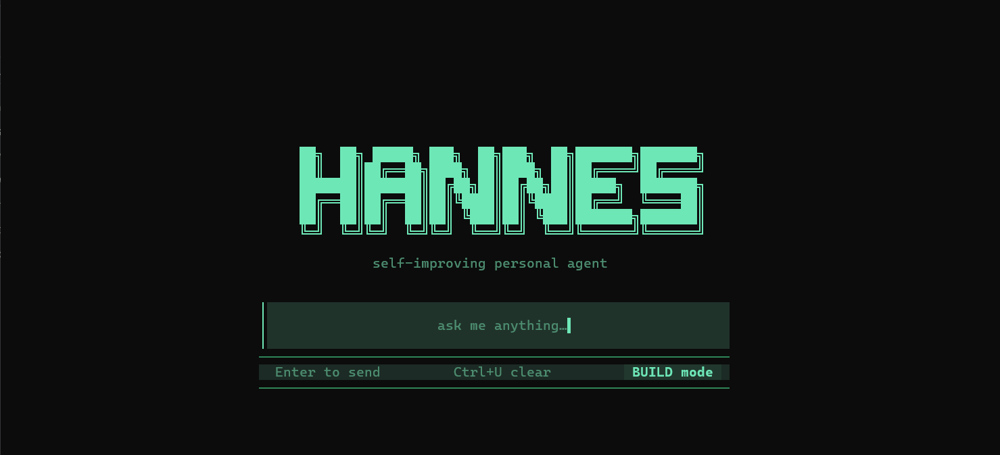

# Hannes-Agent

> A self-improving personal CLI agent by **Dopamine Team** — it learns from every conversation and gets smarter the more you use it.

```
⌘ Hannes-Agent              Dopamine Team   v2.0
──────────────────────────────────────────────────
 · core loaded                                   LEVEL 3
 · 87 skills · 26 tools               learned   47 facts
 · 9router · qwen3.8 max              skills    12 tracked
 · Projects/hannes-agent              next lv   7/20
━━━━━━━━━━━━━━━━━━━━━━━━━╌╌╌╌╌╌╌╌╌╌╌╌╌╌╌╌╌╌╌╌╌╌╌╌╌╌╌
```

---

## Preview



---

## What is Hannes?

Hannes is a **pure CLI agent** that learns from every conversation — automatically, without being told to. It builds skills, remembers facts, and gets smarter the more you use it.

No messaging gateway. No dashboard. No cron scheduler. Just you, the terminal, and an agent that actually improves over time.

---

## Quick start

### One-liner install (recommended)

**Windows (PowerShell):**
```powershell
iex (irm https://raw.githubusercontent.com/MisthiosOG/Hannes-Agent/main/scripts/install.ps1)
```

**Windows (CMD):**
```cmd
curl -fsSL https://raw.githubusercontent.com/MisthiosOG/Hannes-Agent/main/scripts/install.cmd -o install.cmd && install.cmd && del install.cmd
```

**Linux / macOS:**
```bash
curl -fsSL https://raw.githubusercontent.com/MisthiosOG/Hannes-Agent/main/scripts/install.sh | bash
```

### Install via pip (lightweight, no bundled skills)

```bash
pip install git+https://github.com/MisthiosOG/Hannes-Agent
```

Then run:
```bash
hannes
```

---

## Signature features

### Learns without being asked
Every few turns, Hannes reviews the conversation in the background and writes lessons to memory. Correct it once (`"no, that's wrong"`) and it remembers. The more you talk, the smarter it gets.

### /brain — see what it knows
```
/brain          → knowledge map in the terminal (facts, entities, categories)
/brain web      → opens a local HTML graph in your browser
```

### Level & EXP system
The boot banner shows how much Hannes has learned — level up every 20 facts. A full-width progress bar at the bottom tracks XP toward the next level.

### Opencode-style TUI
Clean terminal UI with no emoji clutter, rail-based panels, and a spinner that shows when the agent is working.

### Custom model provider
Add any OpenAI-compatible endpoint directly from `/model`:
```
/model → OpenAI Compatible → paste base URL → paste API key → models auto-load
```

---

## Commands

| Command | What it does |
|---------|-------------|
| `hannes` | Open TUI |
| `hannes chat` | Open TUI (alias) |
| `/model` | Switch model / add custom OpenAI-compatible endpoint |
| `/brain` | Show what Hannes has learned |
| `/brain web` | Open brain graph in browser |
| `/refine` | Manually trigger memory/skill review now |
| `/learn` | Create a skill from this conversation |
| `/skills` | Browse installed skills |
| `/memory` | Review pending memory writes |

---

## How the learning loop works

```
Turn ends
  └─ every 8 turns: background review fork
       ├─ reads conversation
       ├─ writes facts to memory (holographic SQLite store)
       └─ creates/updates skills
  └─ user correction detected ("no", "wrong", "harusnya")
       └─ immediate review — learns from the mistake
```

Facts are stored with trust scores, entity relations, and FTS5 search. Memory grows over time and is recalled automatically at the start of each relevant conversation.

---

## Stack

- **Core:** Python
- **TUI:** TypeScript + Ink (React for terminals)
- **Memory:** Holographic SQLite provider (local, zero cloud dependency)
- **Models:** Any OpenAI-compatible endpoint via OpenRouter, direct API, or custom URL

---

## Configuration

Config lives at `~/.hermes/config.yaml`. Key settings:

```yaml
model:
  default: your-model-id
  provider: openrouter

memory:
  provider: holographic
  nudge_interval: 8        # review every N turns

curator:
  enabled: true            # auto-maintain skills

auxiliary:
  title_generation:
    enabled: true          # auto-name sessions
    language: en
```

---

## Credits

Built and maintained by **Dopamine Team**. Inspired by the open-source agent ecosystem (MIT License).